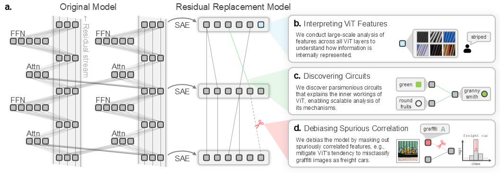

# [NeurIPS 2025] Interpreting vision transformers via residual replacement model

[](https://arxiv.org/abs/2509.17401)



[Jinyeong Kim](https://rubato-yeong.github.io/)<sup>&#42;</sup>, Junhyeok Kim<sup>&#42;</sup>, Yumin Shim, Joohyeok Kim, Sunyoung Jung, [Seong Jae Hwang](https://micv.yonsei.ac.kr/seongjae)<sup>&dagger;</sup>

Yonsei University
(<sup>&#42;</sup>Equal contribution, <sup>&dagger;</sup>Corresponding author)

## Code

The code will be released soon. Please stay tuned! 🚀

## Citation

```
@misc{kim2025interpretingvisiontransformersresidual,
      title={Interpreting vision transformers via residual replacement model}, 
      author={Jinyeong Kim and Junhyeok Kim and Yumin Shim and Joohyeok Kim and Sunyoung Jung and Seong Jae Hwang},
      year={2025},
      eprint={2509.17401},
      archivePrefix={arXiv},
      primaryClass={cs.CV},
      url={https://arxiv.org/abs/2509.17401}, 
}
```